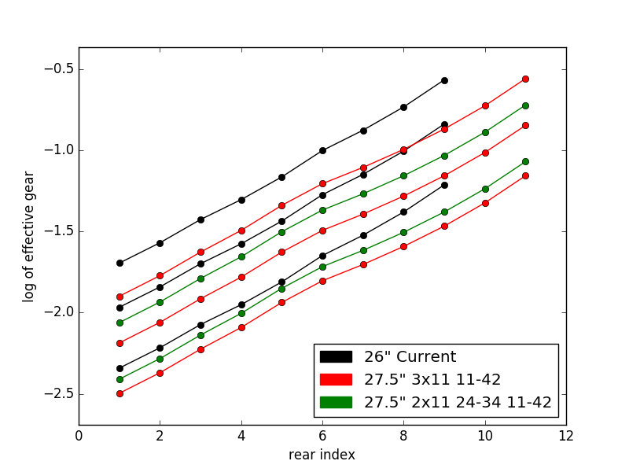

A Python 3 program that plots gear ratios so that you can compare
different wheel sizes / cranksets / chainrings / cassettes.

The y axis shows the gear ratio; the x axis shows the gear index.  To
be more precise, the y axis is the natural log of the [gain
ratio](http://www.sheldonbrown.com/gain.html) and so takes acount of
wheel size and crank length).  But you don't need to understand that
to use the plots - just understand that larger numbers are bigger
gears and compare by eye.

## Example



The example above compares my old 26" 9 speed bike with the latest XT
M8000 groupset on a bike with 27.5" wheels (in particular, the triple
chainring and the lowest geared double).

From the plot you can see that the triple XT (red) has a top gear
similar to the top gear of my existing setup (black) and a
significantly lower bottom gear.  While the double XT loses one gear
at the top and goes slightly lower at the bottom (about half a step).

## To Use

The following instructions are for Linux.  I am sure you can run
Python programs on Windows, but you'll have to work out the exact
details yourself.

Optionally, create a local env with the required libraries:

```
./mkenv.sh
. env/bin/activate
```

(the above takes some time as it downloads and installs various
packages).

Or, alternatively, use an already-installed Python 3 with matplotlib
and dependencies.

To run the program:

```
python gears.py
```

Edit the source to change what is displayed.
